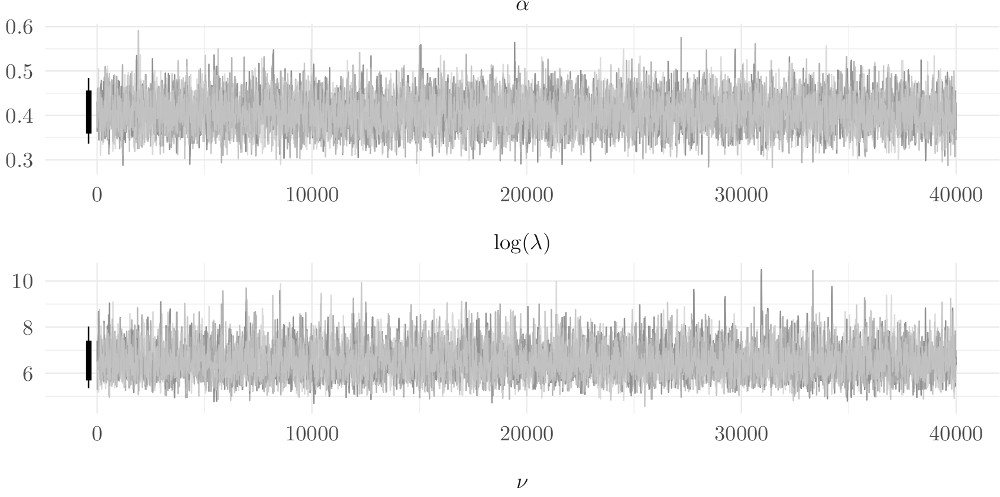

```{r}
#| include: false
#| eval: true
#| echo: false
hecbleu <- c("#002855")
fcols <- c(gris = "#888b8d",
           bleu = "#0072ce",
           aqua = "#00aec7",
           vert = "#26d07c",
           rouge = "#ff585d",
           rose = "#eb6fbd",
           jaune = "#f3d03e")
pcols <- c(gris = "#d9d9d6",
           bleu = "#92c1e9",
           agua = "#88dbdf",
           vert = "#8fe2b0",
           rouge = "#ffb1bb",
           rose = "#eab8e4",
           jaune = "#f2f0a1")
library(ggplot2)
theme_set(theme_classic())
library(patchwork)
knitr::opts_chunk$set(fig.retina = 3, collapse = TRUE)
options(digits = 3, width = 75)
```

## Markov chain Monte Carlo

We consider simulating from a distribution with associated density function proportional to $p(\cdot)$

- using an algorithm that generates a Markov chain ,
- without requiring knowledge of the normalizing factor.


We use a conditional density $q(\boldsymbol{\theta} \mid \boldsymbol{\theta}^{\text{cur}})$ to generate proposals from the current value $\boldsymbol{\theta}^{\text{cur}}.$


## Metropolis--Hastings algorithm 

Starting from an initial value $\boldsymbol{\theta}_0$: for $t=1, \ldots, T$

1.  draw a proposal value $\boldsymbol{\theta}_t^{\star} \sim q(\boldsymbol{\theta} \mid \boldsymbol{\theta}_{t-1})$.
2.  Compute the acceptance ratio $$
    R = \frac{p(\boldsymbol{\theta}_t^{\star})}{p(\boldsymbol{\theta}_{t-1})}\frac{q(\boldsymbol{\theta}_{t-1} \mid \boldsymbol{\theta}_t^{\star} )}{q(\boldsymbol{\theta}_t^{\star} \mid \boldsymbol{\theta}_{t-1})}
    $$
3.  With probability $\alpha=\min\{R, 1\}$, accept the proposal and set $\boldsymbol{\theta}_t \gets \boldsymbol{\theta}_t^{\star}$, otherwise set the value to the previous state, $\boldsymbol{\theta}_t \gets \boldsymbol{\theta}_{t-1}$.

## Theory

The Metropolis--Hastings algorithm satisfies a technical condition (detailed balance) that ensures that the Markov chain generated is reversible. 

- Thus, any draw from the posterior will generate a new realization from the posterior. 
- Provided the starting value has non-zero probability under the posterior, the chain will converge to the stationarity distribution (albeit perhaps slowly).


## Interpretation


- If $R>1$, the proposal has higher density and we always accept the move. 
- If we reject the move, the Markov chain stays at the current value, which induces autocorrelation.
- Since the acceptance probability depends only on the density through ratios, normalizing factors of $p$ and $q$ cancel out.


## Symmetric proposals and random walk

If the proposal is symmetric, the ratio of proposal densities is $$q(\boldsymbol{\theta}_{t-1} \mid \boldsymbol{\theta}_t^{\star} ) / q(\boldsymbol{\theta}_t^{\star} \mid \boldsymbol{\theta}_{t-1}) = 1.$$

Common examples include random walk proposals
$$\boldsymbol{\theta}_t^{\star} \gets \boldsymbol{\theta}_{t-1} + \tau Z,$$ where $Z \sim \mathsf{Gauss}(0,1).$

## Independent proposals

- If we pick instead a global proposal, we must ensure that $q$ samples in far regions (recall rejection sampling), otherwise ...
- Good proposals include heavy tailed distribution such as Student-$t$ with small degrees of freedom, 

- centered at the maximum a posteriori $\widehat{\boldsymbol{\theta}}$ and 
- with scale matrix proportional to $-\mathbf{H}^{-1}(\boldsymbol{\theta}_t^{\star})$, where $\mathbf{H}(\cdot)$ is the Hessian of the (unnormalized) log posterior.


## Upworthy data example

We model the Poisson rates for headlines with questions or not. Our model is
\begin{align*}
Y_{i} &\sim \mathsf{Poisson}(n_i\lambda_i), \qquad (i=1,2)\\
\lambda_1 &= \exp(\beta + \kappa) \\
\lambda_2 &= \exp(\beta) \\
\beta & \sim \mathsf{Gauss}(\log 0.01, 1.5) \\
\kappa &\sim \mathsf{Gauss}(0, 1)
\end{align*}

## Implementation details: data and containers

In regression models, scale inputs if possible.

```{r}
#| eval: false
#| echo: true
# Load data
data(upworthy_question, package = "hecbayes")
# Compute sufficient statistics
data <- upworthy_question |>
  dplyr::group_by(question) |>
  dplyr::summarize(ntot = sum(impressions),
                   y = sum(clicks))
# Create containers for MCMC
niter <- 1e4L
chain <- matrix(0, nrow = niter, ncol = 2L)
colnames(chain) <- c("beta","kappa")
logpost_v <- numeric(niter)
```


## Implementation details: log posterior function

Perform all calculations on the log scale to avoid numerical overflow! 

```{r}
#| eval: false
#| echo: true
# Code log posterior as sum of log likelihood and log prior
loglik <- function(par, counts = data$y, offset = data$ntot, ...){
  lambda <- exp(c(par[1] + log(offset[1]), 
                  par[1] + par[2] + log(offset[2])))
 sum(dpois(x = counts, lambda = lambda, log = TRUE))
}
# Note common signature of function
logprior <- function(par, ...){
  dnorm(x = par[1], mean = log(0.01), sd = 1.5, log = TRUE) +
    dnorm(x = par[2], log = TRUE)
}
logpost <- function(par, ...){
  loglik(par, ...) + logprior(par, ...)
}
```

## Implementation details: proposals

Use good starting values for your Markov chains, such as maximum a posteriori.

```{r}
#| eval: false
#| echo: true
# Compute maximum a posteriori (MAP)
map <- optim(
  par = c(-4, 0.07),
  fn = logpost,
  control = list(fnscale = -1),
  offset = data$ntot,
  counts = data$y,
  hessian = TRUE)
# Use MAP as starting value
cur <- map$par
# Keep track of log posterior to reduce calculations
logpost_cur <- logpost(cur)
# Proposal covariance
cov_map <- -2*solve(map$hessian)
chol <- chol(cov_map)
```

## Implementation details: Metropolis--Hastings

Use seed for reproducibility, do not compute posterior twice, compute log of acceptance ratio. 

```{r}
#| eval: false
#| echo: true
set.seed(80601)
naccept <- 0L
for(i in seq_len(niter)){
  # Multivariate normal proposal - symmetric random walk
  prop <- c(rnorm(n = 2) %*% chol + cur)
  logpost_prop <- logpost(prop)
  logR <- logpost_prop - logpost_cur
  if(logR > -rexp(1)){# accept move
    cur <- prop
    logpost_cur <- logpost_v[i] <- logpost_prop
    naccept <- naccept + 1L
  }
  logpost_v[i] <- logpost_cur 
  chain[i,] <- cur
}
```

## Implementation details: analysis of output


```{r}
#| eval: false
#| echo: true
# Posterior summaries
summary(coda::as.mcmc(chain))
```

```
1. Empirical mean and standard deviation for each variable,
   plus standard error of the mean:

          Mean       SD  Naive SE Time-series SE
beta  -4.51268 0.001697 1.697e-05      6.176e-05
kappa  0.07075 0.002033 2.033e-05      9.741e-05

2. Quantiles for each variable:

          2.5%      25%      50%      75%    97.5%
beta  -4.51591 -4.51385 -4.51273 -4.51154 -4.50929
kappa  0.06673  0.06933  0.07077  0.07212  0.07463
```


## Metropolis--Hastings algorithm 

Starting from an initial value $\boldsymbol{\theta}_0$:

1.  draw a proposal value $\boldsymbol{\theta}_t^{\star} \sim q(\boldsymbol{\theta} \mid \boldsymbol{\theta}_{t-1})$.
2.  Compute the acceptance ratio $$
    R = \frac{p(\boldsymbol{\theta}_t^{\star})}{p(\boldsymbol{\theta}_{t-1})}\frac{q(\boldsymbol{\theta}_{t-1} \mid \boldsymbol{\theta}_t^{\star} )}{q(\boldsymbol{\theta}_t^{\star} \mid \boldsymbol{\theta}_{t-1})}
    $$
3.  With probability $\min\{R, 1\}$, accept the proposal and set $\boldsymbol{\theta}_t \gets \boldsymbol{\theta}_t^{\star}$, otherwise set the value to the previous state, $\boldsymbol{\theta}_t \gets \boldsymbol{\theta}_{t-1}$.

## Calculations


We compute the log of the acceptance ratio, $\ln R$, to avoid numerical overflow, with the log posterior difference
$$
\ln \left\{\frac{p(\boldsymbol{\theta}_t^{\star})}{p(\boldsymbol{\theta}_{t-1})}\right\} = \ell(\boldsymbol{\theta}_t^{\star}) + \ln p(\boldsymbol{\theta}_t^{\star}) - \ell(\boldsymbol{\theta}_{t-1}) - \ln p(\boldsymbol{\theta}_{t-1}) 
$$


Compare the value of $\ln R$ (if less than zero) to $\log(U)$, where $U \sim \mathsf{unif}(0,1)$. 


## What proposal?

The *independence* Metropolis--Hastings uses a global proposal $q$ which does not depend on the current state (typically centered at the MAP)

- This may be problematic with multimodal targets.

The Gaussian random walk takes $\boldsymbol{\theta}_t^{\star} =\boldsymbol{\theta}_{t-1}+ \sigma_\text{p}Z$, where $Z \sim \mathsf{Gauss}(0,1)$ and $\sigma_\text{p}$ is the proposal standard deviation. *Random walks* allow us to explore the space.


## Breaking down the Markov chain

We distinguish between three phases

- **burn in** period: initial draws allowing the algorithm to converge to it's stationary distribution (discarded)
- **warmup** adaptation period: tuning period for the proposal std. deviation, etc. (discarded)
- sampling period: draws post burn in and warmup that are kept for inference

We can optionally **thin** by keeping one every $k$ iterations from the sampling period to reduce the storage.

## Is my answer right?

For us to get the correct answer, we need:

- The algorithm implementation must be correct.
- The chain must have converged to the target posterior.
- The effective sample size of the sample must be sufficiently large for inference.


## Burn in

We are guaranteed to reach stationarity with Metropolis--Hastings eventually, but it may take a large number of iterations...

One should discard initial draws during a **burn in** or warmup period if the chain has not reached stationarity. Ideally, use good starting value to reduce waste.

We can also use the warmup period to adapt the variance of the proposal.

## Goldilock principle and proposal variance

Mixing of the chain requires just the right variance (not too small nor too large).

```{r}
#| eval: true
#| echo: false
#| cache: true
#| label: fig-goldilock-trace
#| fig-cap: "Example of traceplot with proposal variance that is too small (top), adequate (middle) and too large (bottom)."
set.seed(80601)
niter <- 1000
fakesamp <- rnorm(n = 20, mean = 1, sd = 2)
fn <- function(par){ sum(dnorm(fakesamp, mean = par, sd = 2, log = TRUE))}
chains_goldi <- matrix(nrow = niter, ncol = 3)
cur <- rep(0,3)
for(i in seq_len(niter)){
  chains_goldi[i,] <-
    c(mgp::mh.fun(cur = cur[1], lb = -Inf, ub = Inf, prior.fun = identity, lik.fun = fn, pcov = matrix(0.01), cond = FALSE, transform = FALSE)$cur,
      mgp::mh.fun(cur = cur[2], lb = -Inf, ub = Inf, prior.fun = identity, lik.fun = fn, pcov = matrix(2), cond = FALSE, transform = FALSE)$cur,
      mgp::mh.fun(cur = cur[3], lb = -Inf, ub = Inf, prior.fun = identity, lik.fun = fn, pcov = matrix(25), cond = FALSE, transform = FALSE)$cur)
  cur <- chains_goldi[i,] 
}
accept <- apply(chains_goldi, 2, function(x){
  length(unique(x))/niter})
colnames(chains_goldi) <- c("small","medium","large")
# coda::traceplot(coda::as.mcmc(chains_goldi))
bayesplot::mcmc_trace(x = coda::as.mcmc(chains_goldi), 
           n_warmup = 0,facet_args = list(nrow = 3)) + theme_classic()

# chain1 <- mcmc::metrop(obj = fn, initial = 0, nbatch = 40, blen = 1000)
# chain2 <- mcmc::metrop(obj = fn, initial = 0, nbatch = 40, blen = 1000, scale = 0.1)
# chain3 <- mcmc::metrop(obj = fn, initial = 0, nbatch = 40, blen = 1000, scale = 0.4)

```

## Correlograms of MCMC output 


```{r}
#| eval: true
#| echo: false
#| fig-height: 4
#| fig-width: 10
#| label: fig-goldilock-correlogram
#| fig-cap: "Correlogram for the three Markov chains."
bayesplot::mcmc_acf(x = coda::as.mcmc(chains_goldi)) + theme_classic()
```


## Tuning Markov chain Monte Carlo

- Outside of starting values, the variance of the proposal has a huge impact on the asymptotic variance.
- We can adapt the variance during warmup by increasing/decreasing proposal variance (if acceptance rate is too large/small).
- We can check this via the acceptance rate (how many proposals are accepted).

## Optimal acceptance rates 

The following rules were derived for Gaussian targets under idealized situations.

- In 1D, rule of thumb is an acceptance rate of $0.44$ is optimal, and this ratio decreases to $0.234$ when $D \geq 2$ [@Sherlock:2013] for random walk Metropolis--Hastings.
- Proposals for $D$-variate update should have proposal variance of roughly $(2.38^2/d)\times \boldsymbol{\Sigma}$, where $\boldsymbol{\Sigma}$ is the posterior variance.
- For MALA (see later), we get $0.574$ rather than $0.234$

## Block update or one parameter at a time?

As with any accept-reject, proposals become inefficient when the dimension $D$ increase.

This is the **curse of dimensionality**.

Updating parameters in turn 

- increases acceptance rate (with clever proposals), 
- but also leads to more autocorrelation between parameters

## Solutions for strongly correlated coefficients

- Reparametrize the model to decorrelate variables (orthogonal parametrization).
- Block updates: draw correlated parameters together 
   - using the chain history to learn the correlation, if necessary


## Parameter transformation

Parameters may be bounded, e.g. $\theta_i \in [a,b]$.

- We can ignore this and simply discard proposals outside of the range, by setting the log posterior at $-\infty$ outside $[a,b]$
- We can do a transformation, e.g., $\log \theta_i$ if $\theta_i > 0$ and perform a random walk on the unconstrained space: don't forget Jacobians for $q(\cdot)$!
- Another alternative is to use truncated proposals (useful with more complex algorithms like MALA)


## Visual diagnostic: trace plots

Display the Markov chain sample path as a function of the number of iterations.

- Ideally, run multiple chains to see if they converge to the same mode (for multimodal behaviour).
- Markov chains should look like a fat hairy caterpillar!
- Check the `bayesplot` and `coda` **R** packages (trace plot, trace rank, correlograms, marginal densities, etc.)


## Checking convergence with multiple chains




## Trace rank plot


A **trace rank** plot compares the rank of the values of the different chain at a given iteration.


- With good mixing, the ranks should switch frequently and be distributed uniformly across integers.

<!--

## Effective sample size

Are my chains long enough to compute reliable summaries?

Compute the sample size we would have with independent draws by taking
$$
\mathsf{ESS} = \frac{B}{\left\{1+2\sum_{t=1}^\infty \rho_t\right\}}
$$ 
where $\rho_t$ is the lag $t$ autocorrelation. 

The relative effective sample size is simply $\mathsf{ESS}/B$: small values indicate pathological or inefficient samplers. 

## How many samples?

We want our average estimate to be reliable!

- We probably need $\mathsf{ESS}$ to be several hundred 
- We can estimate the variance of the target to know the precision

- (related question: how many significant digits to report?)

-->

## Lack of stationarity


```{r}
#| eval: true
#| echo: false
#| cache: true
#| label: fig-badstart
#| fig-cap: "Traceplots of three Markov chains for the same target with different initial values for the first 500 iterations (left) and trace rank plot after discarding these (right). The latter is indicative of the speed of mixing."
set.seed(80601)
niter <- 2500
fakesamp <- rnorm(n = 20, mean = 1, sd = 2)
fn <- function(par){ sum(dnorm(fakesamp, mean = par, sd = 2, log = TRUE))}
chain1 <- matrix(nrow = niter, ncol = 1)
colnames(chain1) <- "beta"
chain2 <- chain3 <-  chain1
cur <- c(-50, 10, 0)
for(i in seq_len(niter)){
  chain1[i,1] <- mgp::mh.fun(cur = cur[1], lb = -Inf, ub = Inf, prior.fun = identity, lik.fun = fn, pcov = matrix(0.3), cond = FALSE, transform = FALSE)$cur
  chain2[i,1] <- mgp::mh.fun(cur = cur[2], lb = -Inf, ub = Inf, prior.fun = identity, lik.fun = fn, pcov = matrix(0.3), cond = FALSE, transform = FALSE)$cur
  chain3[i,1] <- mgp::mh.fun(cur = cur[3], lb = -Inf, ub = Inf, prior.fun = identity, lik.fun = fn, pcov = matrix(0.3), cond = FALSE, transform = FALSE)$cur
  cur <- c(chain1[i,1], chain2[i,1], chain3[i,1])
}
# coda::traceplot(coda::as.mcmc(chains_goldi))
bayesplot::color_scheme_set("darkgray")
mcmc_list <- coda::mcmc.list(
  coda::mcmc(chain1), 
  coda::mcmc(chain2), 
  coda::mcmc(chain3))
mcmc_list2 <- coda::mcmc.list(
  coda::mcmc(chain1[-(1:500),,drop = FALSE]), 
  coda::mcmc(chain2[-(1:500),,drop = FALSE]), 
  coda::mcmc(chain3[-(1:500),,drop = FALSE]))
g1 <- bayesplot::mcmc_trace(
  x = mcmc_list, 
  n_warmup = 0,window = c(1,500)) +
  labs(y = "") +
  theme(legend.position = "none") +
  theme_classic()
g2 <- bayesplot::mcmc_rank_overlay(
  x = mcmc_list2) +
  labs(y = "") +
  theme(legend.position = "none") +
  theme_classic()
g1 + g2
```


## Summary (1/3)


* Metropolis--Hastings generalizes rejection sampling by building a Markov chain and providing a mechanism for sampling.
* Small proposal variance leads to high acceptance rate, but small step sizes. Large variance proposals leads to many rejections, in which case the previous value is carried forward. Both extreme scenarios lead to large autocorrelation.
* The proposal density can be anything, but must ideally account for the support and allow for exploration of the state.

## Summary (2/3)

* Good initial starting values can be obtained by computing maximum a posteriori estimates.
* Initializing multiple chains at different starting values can be used to check convergence to the stationary distribution.
* Mixing will improve if strongly correlated parameters are sampled together.

## Summary (3/3)

* The optimal acceptance rate depends on the dimension, but guidelines for random walk Metropolis with Gaussian targets are to have 0.44 for a single parameter model and 0.234 for multivariate targets; see @Neal:2011 for a heuristic derivation.
* To obtain the target acceptance rate, users must tune the variance of the proposal kernel. This is typically achieved by running the chain for some period, computing the empirical acceptance rate and increasing (respectively decreasing) the variance if the acceptance rate is too high (too low).


## References

