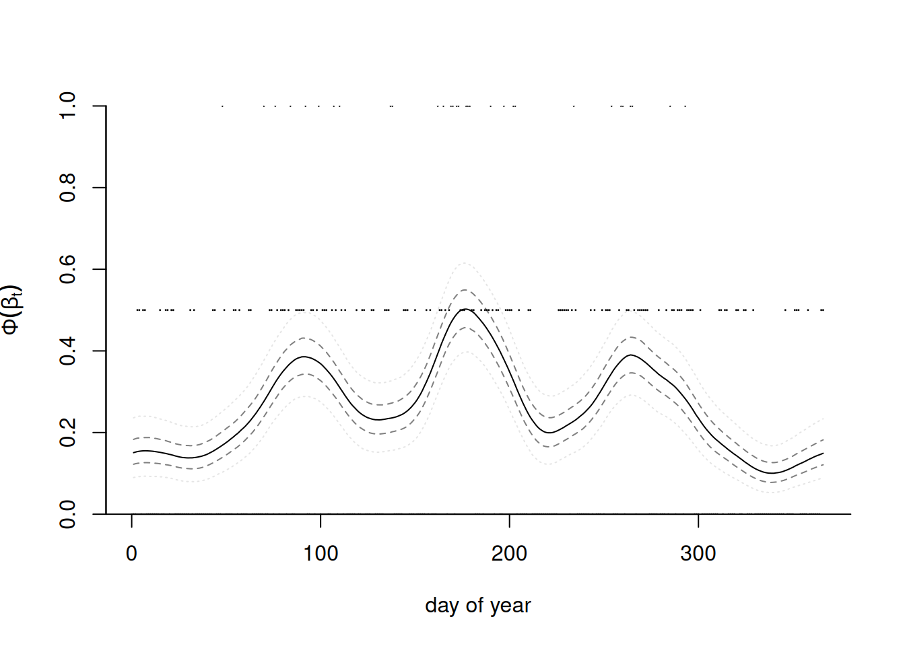
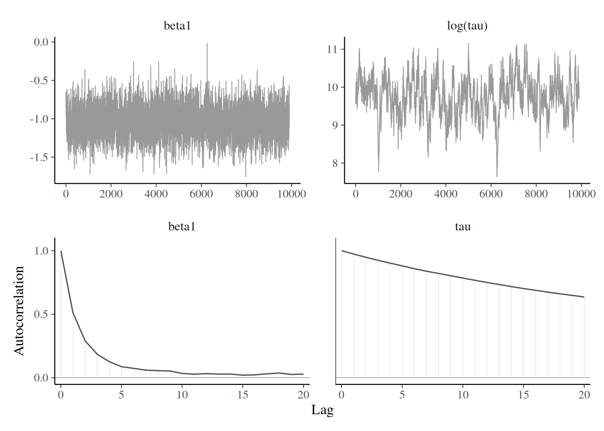
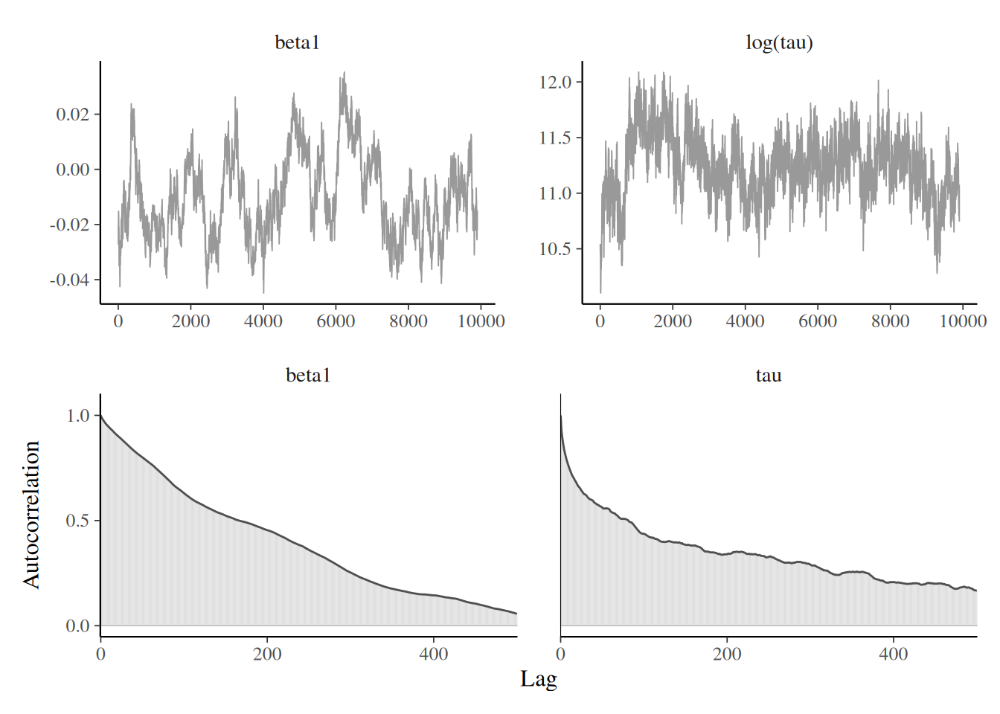

```{r}
#| include: false
#| eval: true
#| echo: false
hecbleu <- c("#002855")
fcols <- c(gris = "#888b8d",
           bleu = "#0072ce",
           aqua = "#00aec7",
           vert = "#26d07c",
           rouge = "#ff585d",
           rose = "#eb6fbd",
           jaune = "#f3d03e")
pcols <- c(gris = "#d9d9d6",
           bleu = "#92c1e9",
           agua = "#88dbdf",
           vert = "#8fe2b0",
           rouge = "#ffb1bb",
           rose = "#eab8e4",
           jaune = "#f2f0a1")
library(ggplot2)
theme_set(theme_classic())
library(patchwork)
knitr::opts_chunk$set(fig.retina = 3, collapse = TRUE)
options(digits = 3, width = 75)
```


## Gibbs sampling

The Gibbs sampling algorithm builds a Markov chain by iterating through a sequence of conditional distributions. 


```{r}
#| eval: true
#| echo: false
#| cache: true
#| message: false
#| warning: false
#| fig-cap: "Sampling trajectory for a bivariate target using Gibbs sampling."
#| label: fig-Gibbs-steps
xg <- seq(-3,6, length.out = 101)
yg <- seq(0, 7, length.out = 101)
grid <- as.matrix(expand.grid(xg, yg))
zg <- TruncatedNormal::dtmvnorm(x = grid, 
                                mu = c(2,1), 
                                sigma = cbind(c(2,-1), c(-1,3)),
                                lb = c(-Inf, 0.1),
                                ub = rep(Inf, 2))

set.seed(1234)
chains <- matrix(nrow = 50, ncol = 2)
curr <- c(-1,3)
for(i in 1:nrow(chains)){
  j <- i %% 2 + 1L
  curr[j] <- mgp::rcondmvtnorm(model = "norm",
                               n = 1, ind = j, x = curr[-j], lbound = c(-3, 0.1)[j], 
                  ubound = c(6,7)[j], mu = c(2,1), 
                                sigma = cbind(c(2,-1), c(-1,3)))
  chains[i,] <- curr
}

ggplot() + 
  geom_contour_filled(data = data.frame(x = grid[,1], y = grid[,2], z = zg),
       mapping = aes(x = x, y = y, z = z),
       alpha = 0.1) +
  geom_path(data = data.frame(x = chains[,1], y = chains[,2],
                              shade = seq(0.1, 0.5, length.out = nrow(chains))),
            mapping = aes(x = x, y = y, alpha = shade)) + 
  scale_y_continuous(limits = c(0,6), expand = c(0,0), breaks = NULL) + 
  scale_x_continuous(limits = c(-3, 5), expand = c(0,0), breaks = NULL) + 
  theme_void() + 
  labs(x = "", y = "") + 
  theme(legend.position = "none")


```


## Gibbs sampler

Split the parameter vector $\boldsymbol{\theta} \in \boldsymbol{\Theta} \subseteq \mathbb{R}^p$ into $m \leq p$ blocks, $$\boldsymbol{\theta}^{[j]}\quad j=1, \ldots, m$$
such that, conditional on the remaining components of the parameter vector $\boldsymbol{\theta}^{-[j]}$, the conditional posterior $$p(\boldsymbol{\theta}^{[j]} \mid \boldsymbol{\theta}^{-[j]}, \boldsymbol{y})$$
is from a known distribution from which we can easily simulate.

## Gibbs sampling update

At iteration $t$, we can update each block in turn: note that the $k$th block uses the partially updated state
\begin{align*}
\boldsymbol{\theta}^{-[k]\star} = (\boldsymbol{\theta}_{t}^{[1]}, \ldots, \boldsymbol{\theta}_{t}^{[k-1]},\boldsymbol{\theta}_{t-1}^{[k+1]}, \boldsymbol{\theta}_{t-1}^{[m]})
\end{align*}
which corresponds to the current value of the parameter vector after the updates. 

## Notes on Gibbs sampling

- Special case of Metropolis--Hastings with conditional density as proposal $q$. 
- The benefit is that all proposals get accepted, $R=1$!
- No tuning parameter, but parametrization matters.
- Automatic acceptance does not equal efficiency.

To check the validity of the Gibbs sampler, see the methods proposed in @Geweke:2004.


## Efficiency of Gibbs sampling

As the dimension of the parameter space increases, and as the correlation between components becomes larger, the efficiency of the Gibbs sampler degrades

```{r}
#| eval: true
#| echo: false
#| cache: true
#| message: false
#| warning: false
#| label: fig-gibbs-normal
#| fig-cap: "Trace plots (top) and correlograms (bottom) for the first component of a Gibbs sampler with $d=20$ equicorrelated Gaussian variates with correlation $\\rho=0.9$ (left) and $d=3$ with equicorrelation $\\rho=0.5$ (right)."
d <- 20
Q <- hecbayes::equicorrelation(d = d, rho = 0.9, precision = TRUE)
B <- 1e3
chains <- matrix(0, nrow = B, ncol = d)
mu <- rep(2, d)
# Start far from mode
curr <- rep(-2, d)
for(i in seq_len(B)){
  # Random scan, updating one variable at a time
  for(j in sample(1:d, size = d)){
    # sample from conditional Gaussian given curr
    curr[j] <- hecbayes::rcondmvnorm(
      n = 1, 
      value = curr, 
      ind = j, 
      mean = mu, 
      precision = Q)
  }
  chains[i,] <- curr # save after full round of update
}
d <- 3
Q <- hecbayes::equicorrelation(d = d, rho = 0.5, precision = TRUE)
chains2 <- matrix(0, nrow = B, ncol = d)
mu <- rep(2, d)
# Start far from mode
curr <- rep(-3, d)
for(i in seq_len(B)){
  # Random scan, updating one variable at a time
  for(j in sample(1:d, size = d)){
    # sample from conditional Gaussian given curr
    curr[j] <- hecbayes::rcondmvnorm(
      n = 1, 
      value = curr, 
      ind = j, 
      mean = mu, 
      precision = Q)
  }
  chains2[i,] <- curr # save after full round of update
}
ggacf <- function(series) {
  significance_level <- qnorm((1 + 0.95)/2)/sqrt(sum(!is.na(series)))  
  a<-acf(series, plot = FALSE, lag.max = 30)
  a.2<-with(a, data.frame(lag, acf))
  g<- ggplot(a.2[-1,], aes(x=lag,y=acf)) + 
          geom_bar(stat = "identity", position = "identity",
                   width = 0.5) + 
    labs(x = 'lag', y =  "", subtitle = 'autocorrelation') +
          geom_hline(yintercept=c(significance_level,-significance_level), lty=3) +
    scale_x_continuous(breaks = seq(5L, 30L, by = 5L),minor_breaks = 1:30, 
                       limits = c(1,30)) +
    scale_y_continuous(limits = c(-0.2,1), expand = c(0,0))
  return(g);
}
g1 <- ggplot(data = data.frame(x = seq_len(nrow(chains)),
                               y = chains[,1]),
             mapping = aes(x = x, y = y)) +
  geom_line() +
  labs(y = "", x = "iteration number") +
  theme_classic()
g2 <- ggacf(chains[,1]) + theme_classic()
g3 <- ggplot(data = data.frame(x = seq_len(B),
                               y = chains2[,1]),
             mapping = aes(x = x, y = y)) +
  geom_line() +
  labs(y = "", x = "iteration number") +
  theme_classic()
g4 <- ggacf(chains2[,1]) + theme_classic()
(g1 + g3) / (g2 + g4)
```

## Gibbs sampling requires work!

- You need to determine all of the relevant conditional distributions, which often relies on setting conditionally conjugate priors. 
- In large models with multiple layers, full conditionals may only depend on a handful of parameters (via directed acyclic graph and moral graph of the model; not covered).


## Example of Gibbs sampling

Consider independent and identically distributed observations, with
\begin{align*}
Y_i &\sim \mathsf{Gauss}(\mu, \tau), \qquad i=1, \ldots, n) 
\\\mu &\sim \mathsf{Gauss}(\nu, \omega)\\
\tau &\sim \mathsf{inv. gamma}(\alpha, \beta)
\end{align*}

The joint posterior is not available in closed form, but the independent priors for the mean and variance of the observations are conditionally conjugate.

## Joint posterior for Gibbs sample

Write the posterior density as usual,
\begin{align*}
&p(\mu, \tau \mid \boldsymbol{y}) \propto \tau^{-\alpha-1}\exp(-\beta/\tau)\\ &\quad \times \tau^{-n/2}\exp\left\{-\frac{1}{2\tau}\left(\sum_{i=1}^n y_i^2 - 2\mu \sum_{i=1}^n y_i+n\mu^2 \right)\right\}\\&\quad \times \exp\left\{-\frac{(\mu-\nu)^2}{2\omega}\right\} 
\end{align*}

## Recognizing distributions from posterior

Consider the conditional densities of each parameter in turn (up to proportionality):
\begin{align*}
p(\mu \mid \tau, \boldsymbol{y}) &\propto \exp\left\{-\frac{1}{2} \left( \frac{\mu^2-2\mu\overline{y}}{\tau/n} + \frac{\mu^2-2\nu \mu}{\omega}\right)\right\}\\
p(\tau \mid \mu, \boldsymbol{y}) & \propto \tau^{-n/2-\alpha-1}\exp\left[-\frac{\left\{\frac{\sum_{i=1}^n (y_i-\mu)^2}{2} + \beta \right\}}{\tau}\right]
\end{align*}

## Gibs sample
We can simulate in turn 
\begin{align*}
\mu_t \mid \tau_{t-1}, \boldsymbol{y} &\sim \mathsf{Gauss}\left(\frac{n\overline{y}\omega+\tau \nu}{\tau + n\omega}, \frac{\omega \tau}{\tau + n\omega}\right)\\
\tau_t \mid \mu_t, \boldsymbol{y} &\sim \mathsf{inv. gamma}\left\{\frac{n}{2}+\alpha, \frac{\sum_{i=1}^n (y_i-\mu)^2}{2} + \beta\right\}.
\end{align*}


## Data augmentation and auxiliary variables


When the likelihood $p(\boldsymbol{y}; \boldsymbol{\theta})$ is intractable or costly to evaluate (e.g., mixtures, missing data, censoring), auxiliary variables are introduced to simplify calculations.


Consider auxiliary variables $\boldsymbol{U} \in \mathbb{R}^k$ such that 
$$\int_{\mathbb{R}^k} p(\boldsymbol{U}, \boldsymbol{\theta}\mid \boldsymbol{y}) \mathrm{d} \boldsymbol{U} = p(\boldsymbol{\theta}\mid \boldsymbol{y}),$$
i.e., the marginal distribution is that of interest, but evaluation of $p(\boldsymbol{U}, \boldsymbol{\theta}; \boldsymbol{y})$ is cheaper. 

## Bayesian augmentation 

The data augmentation algorithm  [@Tanner.Wong:1987] consists in running a Markov chain on the augmented state space $(\Theta, \mathbb{R}^k)$, simulating in turn from the conditionals 

- $p(\boldsymbol{U}\mid \boldsymbol{\theta}, \boldsymbol{y})$ and
- $p(\boldsymbol{\theta}\mid \boldsymbol{U}, \boldsymbol{y})$ 

For more details and examples, see @vanDyk.Meng:2001 and @Hobert:2011.

## Data augmentation: probit example

Consider independent binary responses $\boldsymbol{Y}_i$,  with
\begin{align*}
p_i = \Pr(Y_i=1) = \Phi(\beta_0 + \beta_1 \mathrm{X}_{i1} + \cdots + \beta_p\mathrm{X}_{ip}),
\end{align*}
where $\Phi$ is the distribution function of the standard Gaussian distribution. The likelihood of the probit model is 
$$L(\boldsymbol{\beta}; \boldsymbol{y}) = \prod_{i=1}^n p_i^{y_i}(1-p_i)^{1-y_i},$$
and this prevents easy simulation. 


## Probit augmentation

We can consider a data augmentation scheme where $Y_i = \mathrm{I}(Z_i > 0)$, where $Z_i \sim \mathsf{Gauss}(\mathbf{x}_i\boldsymbol{\beta}, 1)$, where $\mathbf{x}_i$ is the $i$th row of the design matrix.

The augmented data likelihood is
\begin{align*}
p(\boldsymbol{z}, \boldsymbol{y} \mid \boldsymbol{\beta}) &\propto \exp\left\{-\frac{1}{2}(\boldsymbol{z} - \mathbf{X}\boldsymbol{\beta})^\top(\boldsymbol{z} - \mathbf{X}\boldsymbol{\beta})\right\} \\&\quad \times \prod_{i=1}^n \mathrm{I}(z_i > 0)^{y_i}\mathrm{I}(z_i \le 0)^{1-y_i}
\end{align*}

## Conditional distributions for probit regression

\begin{align*}
\boldsymbol{\beta} \mid \boldsymbol{z}, \boldsymbol{y} &\sim \mathsf{Gauss}\left\{\widehat{\boldsymbol{\beta}}, (\mathbf{X}^\top\mathbf{X})^{-1}\right\}\\
Z_i \mid y_i, \boldsymbol{\beta} &\sim \begin{cases}
\mathsf{trunc. Gauss}(\mathbf{x}_i\boldsymbol{\beta}, -\infty, 0) & y_i =0 \\
\mathsf{trunc. Gauss}(\mathbf{x}_i\boldsymbol{\beta}, 0, \infty) & y_i =1.
\end{cases}
\end{align*}
with $\widehat{\boldsymbol{\beta}}=(\mathbf{X}^\top\mathbf{X})^{-1}\mathbf{X}^\top\boldsymbol{z}$ the ordinary least square estimator.

## Data augmentation with scale mixture of Gaussian

The Laplace distribution with mean $\mu$ and scale $\sigma$ has density
\begin{align*}
f(x; \mu, \sigma) = \frac{1}{2\sigma}\exp\left(-\frac{|x-\mu|}{\sigma}\right),
\end{align*}
and can be expressed as a scale mixture of Gaussians, where $Y \sim \mathsf{Laplace}(\mu, \tau)$ is equivalent to $Y \mid \tau \sim \mathsf{Gauss}(\mu, \tau)$ and $\tau \sim \mathsf{expo}\{(2\sigma)^{-1}\}$.

## Joint posterior for Laplace model

With $p(\mu, \sigma) \propto \sigma^{-1}$, the joint posterior for the i.i.d. sample is
\begin{align*}
p(\boldsymbol{\tau}, \mu, \sigma \mid \boldsymbol{y}) &\propto \left(\prod_{i=1}^n \tau_i\right)^{-1/2}\exp\left\{-\frac{1}{2}\sum_{i=1}^n \frac{(y_i-\mu)^2}{\tau_i}\right\} \\&\quad \times \frac{1}{\sigma^{n+1}}\exp\left(-\frac{1}{2\sigma}\sum_{i=1}^n \tau_i\right)
\end{align*}
 

## Conditional distributions

The conditionals for $\mu \mid \cdots$ and $\sigma \mid \cdots$ are, as usual, Gaussian and inverse gamma, respectively. The variances, $\tau_j$, are conditionally independent of one another, with 
\begin{align*}
p(\tau_j \mid \mu, \sigma, y_j) &\propto \tau_j^{-1/2}\exp\left\{-\frac{1}{2}\frac{(y_j-\mu)^2}{\tau_j} -\frac{1}{2} \frac{\tau_j}{\sigma}\right\}
\end{align*}

## Inverse transformation

With the change of variable $\xi_j=1/\tau_j$, we have
\begin{align*}
p(\xi_j \mid \mu, \sigma, y_j) &\propto \xi_j^{-3/2}\exp\left\{-\frac{1}{2\sigma}\frac{\xi_j(y_j-\mu)^2}{\sigma} -\frac{1}{2} \frac{1}{\xi_j}\right\}\\
\end{align*}
and we recognize the Wald (or inverse Gaussian) density, where $\xi_i \sim \mathsf{Wald}(\nu_i, \lambda)$ with $\nu_i=\{\sigma/(y_i-\mu)^2\}^{1/2}$ and $\lambda=\sigma^{-1}$.


## Bayesian LASSO 

@Park.Casella:2008 use this hierarchical construction to defined the Bayesian LASSO. With a model matrix $\mathbf{X}$ whose columns are standardized to have mean zero and unit standard deviation, we may write
\begin{align*}
\boldsymbol{Y} \mid \mu, \boldsymbol{\beta}, \sigma^2 &\sim  \mathsf{Gauss}_n(\mu \boldsymbol{1}_n + \mathbf{X}\boldsymbol{\beta}, \sigma \mathbf{I}_n)\\
\beta_j \mid \sigma, \tau &\sim \mathsf{Gauss}(0, \sigma\tau)\\
\tau &\sim \mathsf{expo}(\lambda/2)
\end{align*}

## Comment about Bayesian LASSO

- If we set an improper prior $p(\mu, \sigma) \propto \sigma^{-1}$, the resulting conditional distributions are all available and thus the model is amenable to Gibbs sampling.
- The Bayesian LASSO places a Laplace penalty on the regression coefficients, with lower values of $\lambda$ yielding more shrinkage. 
- Contrary to the frequentist setting, none of the posterior draws of $\boldsymbol{\beta}$ are exactly zero.

<!--

## Cautionary warning about stationarity

Batch means only works if the chain is sampling from the stationary distribution! 

The previous result (and any estimate) will be unreliable and biased if the chain is not (yet) sampling from the posterior.

-->

# Computational strategies

## Sources of poor mixing

Slow mixing can be due to the following:

- poor proposals
- strong correlation between posterior parameters
- overparametrization and lack of identifiability


## Computational strategies

These problems can be addressed using one of the following:

- removing redundant parameters or pinning some using sharp priors
- reparametrization
- clever proposals (adaptive MCMC), see @Andrieu.Thoms:2008 and @Rosenthal:2011.
- marginalization
- blocking

## Removing redundant parameters

Consider a one-way ANOVA with $K$ categories, with observation $i$ from group $k$ having
\begin{align*}
Y_{i,k} &\sim \mathsf{Gauss}(\mu + \alpha_k, \sigma^2_y) \\
\alpha_k &\sim \mathsf{Gauss}(0, \sigma^2_\alpha)
\end{align*}
and an improper prior for the mean $p(\mu) \propto 1.$

There are $K+1$ mean parameters for the groups, so we can enforce a sum-to-zero constraint for $\sum_{k=1}^K \alpha_k=0$ and sample $K-1$ parameters for the difference to the global mean.

## Parameter expansion

Add redundant parameter to improve mixing by decorrelating [@Liu.Rubin.Wu:1998]

\begin{align*}
Y_{i,k} &\sim \mathsf{Gauss}(\mu + \xi\eta_k, \sigma^2_y) \\
\eta_k &\sim \mathsf{Gauss}(0, \sigma^2_\eta)
\end{align*}
so that $\sigma_\alpha = |\xi|\sigma_\eta.$

## Marginalization

Given a model $p(\boldsymbol{\theta}, \boldsymbol{Z})$, reduce the dependance by sampling from the marginal

$$
p(\boldsymbol{\theta})= \int p(\boldsymbol{\theta}, \boldsymbol{z}) \mathrm{d} \boldsymbol{z}.
$$

This happens for data augmentation, etc., and reduces dependency between parameters, but typically the likelihood becomes more expensive to compute

## Gaussian model with random effects


Consider a hierarchical Gaussian model of the form
\begin{align*}
\boldsymbol{Y} = \mathbf{X}\boldsymbol{\beta} + \mathbf{Z}\boldsymbol{B} + \boldsymbol{\varepsilon}
\end{align*}
where

- $\mathbf{X}$ is an $n \times p$ design matrix with centered inputs,
- $\boldsymbol{\beta} \sim \mathsf{Gauss}(\boldsymbol{0}_p, \sigma^2\mathbf{I}_p),$
- $\boldsymbol{B}\sim \mathsf{Gauss}_q(\boldsymbol{0}_q, \boldsymbol{\Omega})$ are random effects and
- $\boldsymbol{\varepsilon} \sim \mathsf{Gauss}_n(\boldsymbol{0}_n, \kappa^2\mathbf{I}_n)$ are independent white noise.

## Marginalization of Gaussian models

We can write
\begin{align*}
\boldsymbol{Y} \mid \boldsymbol{\beta}, \boldsymbol{B}, \sigma^2 &\sim \mathsf{Gauss}_n(\mathbf{X}\boldsymbol{\beta} + \mathbf{Z}\boldsymbol{B},  \sigma^2\mathbf{I}_p)\\
\boldsymbol{Y} \mid \boldsymbol{\beta} &\sim \mathsf{Gauss}_n(\mathbf{X}\boldsymbol{\beta}, \mathbf{Q}^{-1}),
\end{align*}
where the second line corresponds to marginalizing out the random effects $\boldsymbol{B}.$

## Efficient calculations for Gaussian models

If, as is often the case, $\boldsymbol{\Omega}^{-1}$ and $\mathbf{Z}$ are sparse matrices, the full precision matrix can be efficiently computed using Shermann--Morisson--Woodbury identity as
\begin{align*}
\mathbf{Q}^{-1} &=   \mathbf{Z}\boldsymbol{\Omega}^{-1}\mathbf{Z}^\top + \kappa^2 \mathbf{I}_n,\\
\kappa^2\mathbf{Q} & = \mathbf{I}_n - \mathbf{Z} \boldsymbol{G}^{-1} \mathbf{Z}^\top,\\
\boldsymbol{G} &= \mathbf{Z}^\top\mathbf{Z} + \kappa^2 \boldsymbol{\Omega}^{-1}
\end{align*}
Section 3.1 of @Nychka:2015 details efficient ways of calculating the quadratic form involving $\mathbf{Q}$ and it's determinant.

## Blocking

Identify groups of strongly correlated parameters and propose a joint update for these.

- The more parameters we propose at the same time, the lower the chance of acceptance
- Often ways to sample these efficiently


## Tokyo rainfall

We consider data from @Kitagawa:1987 that provide a binomial time series giving the number of days in years 1983 and 1984 (a leap year) in which there was more than 1mm of rain in Tokyo; see section 4.3.4 of @Rue.Held:2005.


We have $T=366$ days and $n_t \in \{1,2\}$ $(t=1, \ldots, T)$ the number of observations in day $t$ and $y_t=\{0,\ldots, n_t\}$ the number of days with rain.


## Smoothing probabilities

The objective is to obtain a smoothed probability of rain. The underlying probit model considered takes $Y_t \mid n_t, p_t \sim \mathsf{binom}(n_t, p_t)$ and $p_t = \Phi(\beta_t).$


We specify the random effects $\boldsymbol{\beta} \sim \mathsf{Gauss}_{T}(\boldsymbol{0}, \tau^{-1}\mathbf{Q}^{-1}),$ where $\mathbf{Q}$ is a $T \times T$ precision matrix that encodes the local dependence.

A circular random walk structure of order 2 is used to model the smooth curves by smoothing over neighbors, and enforces small second derivative. This is a suitable prior because it enforces no constraint on the mean structure. 

## Random walk prior

This amounts to specifying the process with for $t \in \mathbb{N} \mod 366 + 1$
\begin{align*}
\Delta^2\beta_t &= (\beta_{t+1} - \beta_t) - (\beta_t - \beta_{t-1})
\\&=-\beta_{t-1} +2 \beta_t - \beta_{t+1} \sim \mathsf{Gauss}(0, \tau^{-1}).
\end{align*}

## Circulant precision matrix {.smaller}

This yields an intrinsic Gaussian Markov random field with a circulant precision matrix $\tau\mathbf{Q}$ of rank $T-1,$ where
\begin{align*}
\mathbf{Q} &=
\begin{pmatrix}
6 & -4 & 1 & 0 & \cdots & 1 & -4\\
-4 & 6 & -4 & 1 & \ddots & 0 & 1 \\
1 & -4 & 6 & -4 & \ddots & 0 & 0 \\
\vdots & \ddots & \ddots  & \ddots  & \ddots  & \ddots & \vdots \\
-4 & 1 & 0 & 0 & \cdots & -4 & 6
\end{pmatrix}.
\end{align*}
Because of the linear dependency, the determinant of $\mathbf{Q}$ is zero.


## Prior draws


```{r}
#| eval: true
#| echo: false
#| fig-cap: "Five realizations from the cyclical random walk Gaussian prior of order 2."
#| label: fig-CRW2-prior
nt <- 366
Q <- hecbayes::crw_Q(d = 366, type = "rw2", sparse = TRUE)
set.seed(1234)
samps <- solve(Matrix::chol(Q), matrix(rnorm(5*366), ncol = 5))
matplot(scale(samps, scale = FALSE),
        bty = "l",
        ylab = "",
 xlab = "day of year",
type = "l",
col = RColorBrewer::brewer.pal(n = 5, name = "Blues"),lwd = seq(2, 1, length.out = 5))

```

## Gibbs sampling for Tokyo data


We can perform data augmentation by imputing Gaussian variables, say $\{z_{t,i}\}$ from truncated Gaussian, where $z_{t,i} = \beta_t + \varepsilon_{t,i}$ and $\varepsilon_{t,i} \sim \mathsf{Gauss}(0,1)$ are independent standard Gaussian and
\begin{align*}
z_{t,i} \mid  y_{t,i}, \beta_t \sim
\begin{cases}
\mathsf{trunc. Gauss}(\beta_t, 1, -\infty, 0) & y_{t,i} = 0 \\
\mathsf{trunc. Gauss}(\beta_t, 1,  0, \infty) & y_{t,i} =1
\end{cases}
\end{align*}

## Posterior for Tokyo data

The posterior is proportional to
\begin{align*}
p(\boldsymbol{\beta} \mid \tau)p(\tau)\prod_{t=1}^{T}\prod_{i=1}^{n_t}p(y_{t,i} \mid z_{t,i}) p(z_{t,i} \mid \beta_t)
\end{align*}

## Data augmentation for Tokyo data

Once we have imputed the Gaussian latent vectors, we can work directly with the values of $z_t = \sum_{i=1}^{n_t} z_{i,t}$ 
\begin{align*}
p(\boldsymbol{\beta}, \tau) &\propto \tau^{(T-1)/2}\exp \left( - \frac{\tau}{2} \boldsymbol{\beta}^\top \mathbf{Q} \boldsymbol{\beta}\right)
\\& \times \exp\left\{ - \frac{1}{2} (\boldsymbol{z}/\boldsymbol{n} - \boldsymbol{\beta})^\top \mathrm{diag}(\boldsymbol{n})(\boldsymbol{z}/\boldsymbol{n} - \boldsymbol{\beta})\right\}
\\& \times \tau^{a-1}\exp(-\tau b)
\end{align*}
where $\boldsymbol{z} = (z_1, \ldots, z_T),$ as $n_t^{-1} z_t \sim \mathsf{Gauss}(\beta_t, n_t^{-1}).$

## Gibbs for Tokyo data - conditionals

Completing the quadratic form shows that
\begin{align*}
\boldsymbol{\beta} \mid \boldsymbol{z}, \tau &\sim \mathsf{Gauss}_T\left(\mathbf{Q}^{\star -1} \boldsymbol{z}, \mathbf{Q}^{\star -1}\right)\\
\tau \mid \boldsymbol{\beta} & \sim \mathsf{gamma}\left( \frac{T-1}{2} + a, \frac{\boldsymbol{\beta}^\top \mathbf{Q}\boldsymbol{\beta}}{2} + b \right),\\
\mathbf{Q}^{\star} &= \left\{\tau \mathbf{Q} + \mathrm{diag}(\boldsymbol{n})\right\}
\end{align*}

## Posterior prediction for probability of rainfall





## Blocking vs joint update

Compare the following two stategies

- joint update: given $\boldsymbol{z}$ and $\tau$, simulate $\boldsymbol{\beta}$ jointly
- one-parameter at a time: starting from $i \sim \mathsf{unif}(\{1, \ldots, 366\}),$ get index $t= i \mod 366 + 1$ and simulate $\beta_i \mid \boldsymbol{\beta}_{-i}, \boldsymbol{z}, \tau$ one at a time.

## Blocking strategy



## Individual update strategy




## Lessons from the Tokyo example


What happened?

- there is lower autocorrelation with the joint update (also faster here!) for the $\boldsymbol{\beta}$
- in both cases, $\tau \mid \cdot$ mixes poorly because the values of $\boldsymbol{\beta}$ were sampled conditional on the previous value.

A better avenue would be to use a Metropolis random walk for $\tau^{\star}$, simulate $\boldsymbol{\beta} \mid \tau^{\star}$ and propose the joint vector $(\tau^{\star}, \boldsymbol{\beta}^{\star})$ simultaneously.

## One step further

We could also remove the data augmentation step and propose from a Gaussian approximation of the log likelihood, using
a Taylor series expansion of the log likelihood about $\boldsymbol{\beta}_{t-1}$
\begin{align*}
 \log p(\boldsymbol{\beta} \mid \boldsymbol{y}) \stackrel{\boldsymbol{\beta}}{\propto} - \frac{\tau}{2} \boldsymbol{\beta}^\top \mathbf{Q} \boldsymbol{\beta} + \sum_{t=1}^T \log f(y_t \mid \beta_t)
\end{align*}
and the $y_t$ are conditionally independent in the likelihood. Refer to Section 4.4.1 of @Rue.Held:2005 for more details.

## Technical aside: in sparsity we trust!

It is crucial to exploit the sparsity structure of $\mathbf{Q}$ for efficient calculations of the likelihood

- typically requires re-ordering elements to get a banded precision matrix
- precompute the sparse Cholesky
- compute inverse by solving systems of linear equations; there are dedicated algorithms


## References

