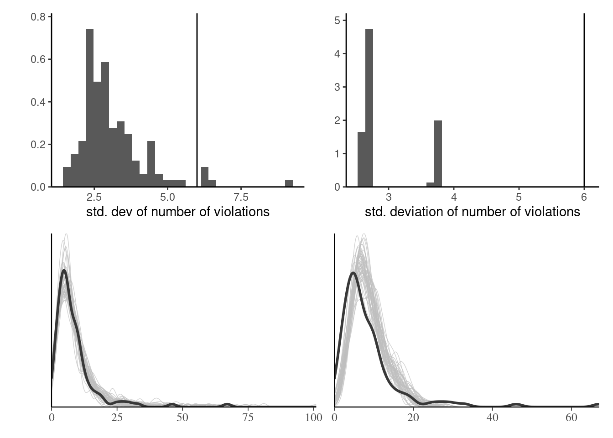
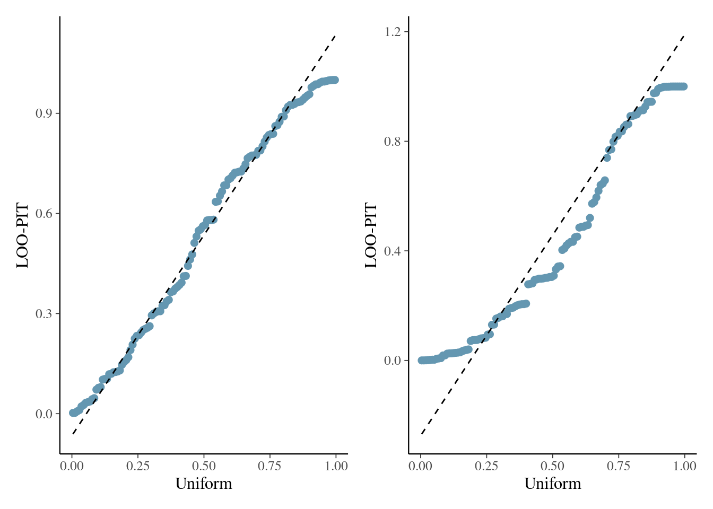

```{r}
#| include: false
#| eval: true
#| echo: false
hecbleu <- c("#002855")
fcols <- c(gris = "#888b8d",
           bleu = "#0072ce",
           aqua = "#00aec7",
           vert = "#26d07c",
           rouge = "#ff585d",
           rose = "#eb6fbd",
           jaune = "#f3d03e")
pcols <- c(gris = "#d9d9d6",
           bleu = "#92c1e9",
           agua = "#88dbdf",
           vert = "#8fe2b0",
           rouge = "#ffb1bb",
           rose = "#eab8e4",
           jaune = "#f2f0a1")
library(ggplot2)
theme_set(theme_classic())
library(patchwork)
knitr::opts_chunk$set(fig.retina = 3, collapse = TRUE)
options(digits = 3, width = 75)
```


## Efficient proposals: MALA {.smaller}

The Metropolis-adjusted Langevin algorithm (MALA) uses a Gaussian random walk proposal $$\boldsymbol{\theta}^{\star}_t \sim \mathsf{Gauss}\{\mu(\boldsymbol{\theta}_{t-1}), \tau^2\mathbf{A}\},$$ with mean $$\mu(\boldsymbol{\theta}_{t-1})=\boldsymbol{\theta}_{t-1} + \mathbf{A}\eta \nabla \log p(\boldsymbol{\theta}_{t-1} \mid \boldsymbol{y}),$$ and variance $\tau^2\mathbf{A}$, for some mass matrix $\mathbf{A}$, tuning parameter $\tau>0$. 

The parameter $\eta < 1$ is a learning rate. This is akin to a Newton algorithm, so beware if you are far from the mode (where the gradient is typically large)!


## Higher order proposals

For a single parameter update $\theta$, a Taylor series expansion of the log posterior around the current value suggests using as proposal density a Gaussian approximation with [@Rue.Held:2005]

- mean $\mu_{t-1} = \theta_{t-1} - f'(\theta_{t-1})/f''(\theta_{t-1})$ and 
- precision $\tau^{-2} = -f''(\theta_{t-1})$

We need $f''(\theta_{t-1})$ to be negative!

This gives **local adaption** relative to MALA (global variance).

## Higher order and moves

For MALA and cie., we need to compute the density of the proposal also for the reverse move for the expansion starting from the proposal $\mu(\boldsymbol{\theta}_{t}^\star)$.

These methods are more efficient than random walk Metropolis--Hastings, but they require the gradient and the hessian (can be obtained analytically using autodiff, or numerically).

## Modelling individual headlines of **Upworthy** example

The number of conversions `nclick` is binomial with sample size $n_i=$`nimpression`.

Since $n_i$ is large, the sample average `nclick`/`nimpression` is approximately Gaussian, so write

\begin{align*}
Y_i &\sim \mathsf{Gauss}(\mu, \sigma^2/n_i)\\
\mu &\sim \mathsf{trunc. Gauss}(0.01, 0.1^2, 0, 1) \\
\sigma &\sim \mathsf{expo}(0.7)
\end{align*}

## MALA: data set-up

```{r}
#| eval: false
#| echo: true
data(upworthy_question, package = "hecbayes")
# Select data for a single question
qdata <- upworthy_question |>
  dplyr::filter(question == "yes") |>
  dplyr::mutate(y = clicks/impressions,
                no = impressions)
```

## MALA: define functions
```{r}
#| eval: false
#| echo: true
# Create functions with the same signature (...) for the algorithm
logpost <- function(par, data, ...){
  mu <- par[1]; sigma <- par[2]
  no <- data$no
  y <- data$y
  if(isTRUE(any(sigma <= 0, mu < 0, mu > 1))){
    return(-Inf)
  }
  dnorm(x = mu, mean = 0.01, sd = 0.1, log = TRUE) +
  dexp(sigma, rate = 0.7, log = TRUE) + 
  sum(dnorm(x = y, mean = mu, sd = sigma/sqrt(no), log = TRUE))
}
```

## MALA: compute gradient of log posterior

```{r}
#| eval: false
#| echo: true
logpost_grad <- function(par, data, ...){
   no <- data$no
  y <- data$y
  mu <- par[1]; sigma <- par[2]
  c(sum(no*(y-mu))/sigma^2 -(mu - 0.01)/0.01,
    -length(y)/sigma + sum(no*(y-mu)^2)/sigma^3 -0.7
  )
}
```


## MALA: compute maximum a posteriori

```{r}
#| eval: false
#| echo: true
# Starting values - MAP
map <- optim(
  par = c(mean(qdata$y), 0.5),
  fn = function(x){-logpost(x, data = qdata)},
  gr = function(x){-logpost_grad(x, data = qdata)},  
  hessian = TRUE,
  method = "BFGS")
# Check convergence 
logpost_grad(map$par, data = qdata)
```

## MALA: starting values and mass matrix

```{r}
#| eval: false
#| echo: true
# Set initial parameter values
curr <- map$par 
# Compute a mass matrix
Amat <- solve(map$hessian)
# Cholesky root - for random number generation
cholA <- chol(Amat)
```

## MALA: containers and setup

```{r}
#| eval: false
#| echo: true
# Create containers for MCMC
B <- 1e4L # number of iterations
warmup <- 1e3L # adaptation period
npar <- 2L
prop_sd <- rep(1, npar) # tuning parameter
chains <- matrix(nrow = B, ncol = npar)
damping <- 0.8
acceptance <- attempts <- 0 
colnames(chains) <- names(curr) <- c("mu","sigma")
# Proposal variance proportional to inverse hessian at MAP
prop_var <- diag(prop_sd) %*% Amat %*% diag(prop_sd)
```

## MALA: sample proposal with Newton step

```{r}
#| eval: false
#| echo: true
for(i in seq_len(B + warmup)){
  ind <- pmax(1, i - warmup)
  # Compute the proposal mean for the Newton step
  prop_mean <- c(curr + damping * 
     Amat %*% logpost_grad(curr, data = qdata))
  # prop <- prop_sd * c(rnorm(npar) %*% cholA) + prop_mean
  prop <- c(mvtnorm::rmvnorm(
    n = 1,
    mean = prop_mean, 
    sigma = prop_var))
#  [...]
```

## MALA: reverse step

```{r}
#| eval: false
#| echo: true
  # Compute the reverse step
  curr_mean <- c(prop + damping * 
     Amat %*% logpost_grad(prop, data = qdata))
  # log of ratio of bivariate Gaussian densities
  logmh <- mvtnorm::dmvnorm(
    x = curr, mean = prop_mean, 
    sigma = prop_var, 
    log = TRUE) - 
    mvtnorm::dmvnorm(
      x = prop, 
      mean = curr_mean, 
      sigma = prop_var, 
      log = TRUE) + 
  logpost(prop, data = qdata) - 
    logpost(curr, data = qdata)
```

## MALA: Metropolis--Hastings ratio

```{r}
#| eval: false
#| echo: true
  if(logmh > log(runif(1))){
    curr <- prop
    acceptance <- acceptance + 1L
  }
  attempts <- attempts + 1L
  # Save current value
  chains[ind,] <- curr
```

## MALA: adaptation

```{r}
#| eval: false
#| echo: true
  if(i %% 100 & i < warmup){
    # Check acceptance rate and increase/decrease variance
    out <- hecbayes::adaptive(
      attempts = attempts, # counter for number of attempts
      acceptance = acceptance, 
      sd.p = prop_sd, #current proposal standard deviation
      target = 0.574) # target acceptance rate
    prop_sd <- out$sd # overwrite current std.dev
    acceptance <- out$acc # if we change std. dev, this is set to zero
    attempts <- out$att # idem, otherwise unchanged
    prop_var <- diag(prop_sd) %*% Amat %*% diag(prop_sd)
  }
} # End of MCMC for loop
```


## Tracking the log posterior

One can store (separately) at each iteration the values of the 

- log likelihood
- log prior

These can be used for prior or likelihood sensitivity [@Kallioinen:2023]


## Strategies

Many diagnostics require running multiple chains

- check within vs between variance,
- determine whether they converge to the same target.


## Blank run

To check that the algorithm is correctly implemented:

- remove the log likelihood component
- run the algorithm with just the prior

The resulting draws should be drawn from the prior if the latter is proper [@Green:2001, p.55].

## Correct implementation

We can generate artificial data to check the procedure.


Simulation-based calibration  [@Talts:2020] proceeds with, in order

1. $\boldsymbol{\theta}_0 \sim p(\boldsymbol{\theta}),$
2. $\boldsymbol{y}_0 \sim p(\boldsymbol{y} \mid \boldsymbol{\theta}_0),$
3. $\boldsymbol{\theta}_1, \ldots, \boldsymbol{\theta}_B \sim p(\boldsymbol{\theta} \mid \boldsymbol{y}_0 ).$


## Simulation-based calibration

- Conditional on the simulated $\boldsymbol{y}$, the distribution of $\boldsymbol{\theta}_0$ is the same as that of $\boldsymbol{\theta}_1, \ldots, \boldsymbol{\theta}_B.$
- We do a dimension reduction step taking the test function $t(\cdot)$ to get the rank of the prior draw among the posterior ones, breaking ties at random if any.
- These steps are repeated $K$ times, yielding $K$ test functions $T_1, \ldots, T_K.$ We then test for uniformity using results from @Sailynoja:2022.


## Gelman--Rubin diagnostic

Suppose we run $M$ chains for $B$ iterations, post burn in. 

Denote by $\theta_{bm}$ the $b$th draw of the $m$th chain, we compute the global average 
$$\overline{\theta} = \frac{1}{BM}\sum_{b=1}^B \sum_{m=1}^m \theta_{bm}$$ and similarly the chain-specific sample average and variances, respectively $\overline{\theta}_m$ and $\widehat{\sigma}^2_m$ ($m=1, \ldots, M$). 

## Sum of square decomposition

The between-chain variance and within-chain variance estimator are
\begin{align*}
\mathsf{Va}_{\text{between}} &= \frac{B}{M-1}\sum_{m=1}^M (\overline{\theta}_m - \overline{\theta})^2\\
\mathsf{Va}_{\text{within}} &= \frac{1}{M}\sum_{m=1}^m \widehat{\sigma}^2_m
\end{align*}

## Potential scale reduction statistic 

The Gelman--Rubin diagnostic, denoted $\widehat{R}$, is obtained by running multiple chains and considering the difference between within-chain and between-chains variances,

\begin{align*}
\widehat{R} = \left(\frac{\mathsf{Va}_{\text{within}}(B-1) + \mathsf{Va}_{\text{between}}}{B\mathsf{Va}_{\text{within}}}\right)^{1/2}
\end{align*}


Any value of $\widehat{R}$ larger 1 is indicative of problems of convergence.

## Bad chains


```{r}
#| eval: true
#| echo: false
#| label: fig-rhat
#| fig-cap: "Two pairs of Markov chains: the top ones seem stationary, but with different modes and  $\\widehat{R} \\approx 3.4$. The chains on the right hover around zero, but do not appear stable, with $\\widehat{R} \\approx 1.6$."
B <- 1000
set.seed(1234)
c1 <- arima.sim(model = list(ar = c(0.6,0.2)), 
                           rand.gen = rexp,
                           n = B) + -2
c2 <- arima.sim(model = list(ar = c(0.5,0.2)),
                           n = B) - 1
chains <- coda::mcmc.list(
  list(theta = coda::mcmc(c1),
       theta = coda::mcmc(c2)))
rhat1 <- coda::gelman.diag(chains)
# bayesplot::mcmc_trace(chains)

g1 <- ggplot(data = data.frame(
    time = rep(seq_len(B), length.out = 2*B),
    chain = c(c1, c2),
    group = factor(rep(c(1,2), each = B))),
  mapping = aes(x = time, y = chain, col = group)) +
  geom_line() +
  scale_color_manual(values = MetBrewer::met.brewer("Renoir", 3)[c(2:3)]) + 
  labs(x = "iteration number", y = "") + 
  theme_classic() +
  theme(legend.position = "none")

set.seed(1234)
c1b <- arima.sim(model = list(ar = c(0.6,0.2)), 
                rand.gen = rnorm,
                n = B) + seq(-2, 2, length.out = B)
c2b <- arima.sim(model = list(ar = c(0.5,0.2)),
                n = B) +  seq(2, -2, length.out = B)
chains <- coda::mcmc.list(
  list(theta = coda::mcmc(c1b),
       theta = coda::mcmc(c2b)))
rhat2 <- coda::gelman.diag(chains)
# bayesplot::mcmc_trace(chains)

g2 <- ggplot(data = data.frame(
  time = rep(seq_len(B), length.out = 2*B),
  chain = c(c1b, c2b),
  group = factor(rep(c(1,2), each = B))),
  mapping = aes(x = time, y = chain, col = group)) +
  geom_line() +
  scale_color_manual(values = MetBrewer::met.brewer("Renoir", 3)[c(2:3)]) + 
  labs(x = "iteration number", y = "") + 
  theme_classic() +
  theme(legend.position = "none")

g1 + g2
```

## One chain or multiple chains?

Generally, it is preferable to run a single chain for a longer period than run multiple chains sequentially

- there is a cost to initializing multiple times with different starting values since we must discard initial draws.
- but with parallel computations, multiple chains are more frequent nowadays.
- multiple diagnostics require running several chains.


## Posterior predictive checks

1. For each of the $B$ draws from the posterior, simulate $n$ observations from the posterior predictive $p(\widetilde{\boldsymbol{y}} \mid \boldsymbol{y})$
2. For each replicate, compute a summary statistics (median, quantiles, std. dev., etc.) 
3. Compare it with the same summary computed for the sample $\boldsymbol{y}$.

## Posterior predictive checks

```{r}
#| eval: true
#| echo: false
#| label: fig-posterior-pred-check
#| fig-cap: "Posterior predictive checks for the standard deviation (top) and density of posterior draws (bottom) for hierarchical Poisson model with individual effects (left) and simpler model with only conditions (right)."

```

## Log pointwise predictive density

Consider the expected value of the observation-wise log density with respect to the posterior distribution $p(\boldsymbol{\theta} \mid \boldsymbol{y})$,
\begin{align*}
\mathsf{LPPD}_i = \mathsf{E}_{\boldsymbol{\theta} \mid \boldsymbol{y}} \left\{ \log p(y_i \mid \boldsymbol{\theta})\right\},
\end{align*}
 
The higher the value of $\mathsf{LPPD}_i$, the better the fit for that observation.

## Widely available information criterion 

To build an information criterion, we add a penalization factor that approximates the effective number of parameters in the model, with
\begin{align*}
n\mathsf{WAIC} = -\sum_{i=1}^n \mathsf{LPPD}_i + \sum_{i=1}^n \mathsf{Va}_{\boldsymbol{\theta} \mid \boldsymbol{y}}\{\log p(y_i \mid \boldsymbol{\theta})\}
\end{align*} 
where we use again the empirical variance to compute the rightmost term.

Smaller values of $\mathsf{WAIC}$ are better.

## Pseudo-code for WAIC

Evaluate the log likelihood for each posterior draw and each observation.
```{r}
#| eval: false
#| echo: true
#| label: fn-waic
#' WAIC
#' @param loglik_pt B by n matrix of pointwise log likelihood
WAIC <- function(loglik_pt){
  -mean(apply(loglik_pt, 2, mean)) +  mean(apply(loglik_pt, 2, var))
}
```

## Bayesian leave-one-out cross validation

In Bayesian setting, we can use the leave-one-out predictive density
$$p(y_i \mid \boldsymbol{y}_{-i})$$ as a measure of predictive accuracy.

We can use importance sampling to approximate the latter.

Requirement: need to keep track of the log likelihood of each observation for each posterior draw ($B \times n$ values).

## LOO-CV diagnostics

We can draw $B$ samples from  $p(\widetilde{y} \mid \boldsymbol{y}_{-i})$ and compute the rank of $y_i$.

Under perfect calibration, ranks should be uniform.

## Leave-one-out with quantile-quantile plots

```{r}
#| eval: true
#| echo: false
#| label: fig-posterior-loocv
#| fig-cap: "Quantile-quantile plots based on leave-one-out cross validation for model for the hierarchical Poisson model fitted to the Upworthy data with the individual random effects (left) and without (right)."

```


## Deviance information criterion


The **deviance** information criterion of @Spiegelhalter:2002 is
\begin{align*}
\mathsf{DIC} = -2 \ell(\widetilde{\boldsymbol{\theta}}) + 2 p_D
\end{align*}
where $p_D$ is the posterior expectation of the deviance relative to the point estimator of the parameter $\widetilde{\boldsymbol{\theta}}$ (e.g., the maximum a posteriori or the posterior mean)
\begin{align*}
p_D = \mathsf{E}\{D(\boldsymbol{\theta}, \widetilde{\boldsymbol{\theta}}) \mid \boldsymbol{y}\}= \int 2 \{ \ell(\widetilde{\boldsymbol{\theta}}) - \ell(\boldsymbol{\theta})\} p(\boldsymbol{\theta} \mid \boldsymbol{y}) \mathrm{d} \boldsymbol{\theta}
\end{align*}


## Criticism of DIC

- The DIC can be easily evaluated by keeping track of the log likelihood evaluated at each posterior draw from a Markov chain Monte Carlo algorithm.
- The penalty term $p_D$ is however not invariant to reparametrizations.
- A Gaussian approximation to the MLE under suitable regularity conditions shows that the $\mathsf{DIC}$ is equivalent in large samples to $\mathsf{AIC}.$


## Gibbs sampling

The Gibbs sampling algorithm builds a Markov chain by iterating through a sequence of conditional distributions. 


```{r}
#| eval: true
#| echo: false
#| cache: true
#| message: false
#| warning: false
#| fig-cap: "Sampling trajectory for a bivariate target using Gibbs sampling."
#| label: fig-Gibbs-steps
xg <- seq(-3,6, length.out = 101)
yg <- seq(0, 7, length.out = 101)
grid <- as.matrix(expand.grid(xg, yg))
zg <- TruncatedNormal::dtmvnorm(x = grid, 
                                mu = c(2,1), 
                                sigma = cbind(c(2,-1), c(-1,3)),
                                lb = c(-Inf, 0.1),
                                ub = rep(Inf, 2))

set.seed(1234)
chains <- matrix(nrow = 50, ncol = 2)
curr <- c(-1,3)
for(i in 1:nrow(chains)){
  j <- i %% 2 + 1L
  curr[j] <- mgp::rcondmvtnorm(model = "norm",
                               n = 1, ind = j, x = curr[-j], lbound = c(-3, 0.1)[j], 
                  ubound = c(6,7)[j], mu = c(2,1), 
                                sigma = cbind(c(2,-1), c(-1,3)))
  chains[i,] <- curr
}

ggplot() + 
  geom_contour_filled(data = data.frame(x = grid[,1], y = grid[,2], z = zg),
       mapping = aes(x = x, y = y, z = z),
       alpha = 0.1) +
  geom_path(data = data.frame(x = chains[,1], y = chains[,2],
                              shade = seq(0.1, 0.5, length.out = nrow(chains))),
            mapping = aes(x = x, y = y, alpha = shade)) + 
  scale_y_continuous(limits = c(0,6), expand = c(0,0), breaks = NULL) + 
  scale_x_continuous(limits = c(-3, 5), expand = c(0,0), breaks = NULL) + 
  theme_void() + 
  labs(x = "", y = "") + 
  theme(legend.position = "none")


```


## Gibbs sampler

Split the parameter vector $\boldsymbol{\theta} \in \boldsymbol{\Theta} \subseteq \mathbb{R}^p$ into $m \leq p$ blocks, $$\boldsymbol{\theta}^{[j]}\quad j=1, \ldots, m$$
such that, conditional on the remaining components of the parameter vector $\boldsymbol{\theta}^{-[j]}$, the conditional posterior $$p(\boldsymbol{\theta}^{[j]} \mid \boldsymbol{\theta}^{-[j]}, \boldsymbol{y})$$
is from a known distribution from which we can easily simulate.

## Gibbs sampling update

At iteration $t$, we can update each block in turn: note that the $k$th block uses the partially updated state
\begin{align*}
\boldsymbol{\theta}^{-[k]\star} = (\boldsymbol{\theta}_{t}^{[1]}, \ldots, \boldsymbol{\theta}_{t}^{[k-1]},\boldsymbol{\theta}_{t-1}^{[k+1]}, \boldsymbol{\theta}_{t-1}^{[m]})
\end{align*}
which corresponds to the current value of the parameter vector after the updates. 

## Notes on Gibbs sampling

- Special case of Metropolis--Hastings with conditional density as proposal $q$. 
- The benefit is that all proposals get accepted, $R=1$!
- No tuning parameter, but parametrization matters.
- Automatic acceptance does not equal efficiency.

To check the validity of the Gibbs sampler, see the methods proposed in @Geweke:2004.


## Efficiency of Gibbs sampling

As the dimension of the parameter space increases, and as the correlation between components becomes larger, the efficiency of the Gibbs sampler degrades

```{r}
#| eval: true
#| echo: false
#| cache: true
#| message: false
#| warning: false
#| label: fig-gibbs-normal
#| fig-cap: "Trace plots (top) and correlograms (bottom) for the first component of a Gibbs sampler with $d=20$ equicorrelated Gaussian variates with correlation $\\rho=0.9$ (left) and $d=3$ with equicorrelation $\\rho=0.5$ (right)."
d <- 20
Q <- hecbayes::equicorrelation(d = d, rho = 0.9, precision = TRUE)
B <- 1e3
chains <- matrix(0, nrow = B, ncol = d)
mu <- rep(2, d)
# Start far from mode
curr <- rep(-2, d)
for(i in seq_len(B)){
  # Random scan, updating one variable at a time
  for(j in sample(1:d, size = d)){
    # sample from conditional Gaussian given curr
    curr[j] <- hecbayes::rcondmvnorm(
      n = 1, 
      value = curr, 
      ind = j, 
      mean = mu, 
      precision = Q)
  }
  chains[i,] <- curr # save after full round of update
}
d <- 3
Q <- hecbayes::equicorrelation(d = d, rho = 0.5, precision = TRUE)
chains2 <- matrix(0, nrow = B, ncol = d)
mu <- rep(2, d)
# Start far from mode
curr <- rep(-3, d)
for(i in seq_len(B)){
  # Random scan, updating one variable at a time
  for(j in sample(1:d, size = d)){
    # sample from conditional Gaussian given curr
    curr[j] <- hecbayes::rcondmvnorm(
      n = 1, 
      value = curr, 
      ind = j, 
      mean = mu, 
      precision = Q)
  }
  chains2[i,] <- curr # save after full round of update
}
ggacf <- function(series) {
  significance_level <- qnorm((1 + 0.95)/2)/sqrt(sum(!is.na(series)))  
  a<-acf(series, plot = FALSE, lag.max = 30)
  a.2<-with(a, data.frame(lag, acf))
  g<- ggplot(a.2[-1,], aes(x=lag,y=acf)) + 
          geom_bar(stat = "identity", position = "identity",
                   width = 0.5) + 
    labs(x = 'lag', y =  "", subtitle = 'autocorrelation') +
          geom_hline(yintercept=c(significance_level,-significance_level), lty=3) +
    scale_x_continuous(breaks = seq(5L, 30L, by = 5L),minor_breaks = 1:30, 
                       limits = c(1,30)) +
    scale_y_continuous(limits = c(-0.2,1), expand = c(0,0))
  return(g);
}
g1 <- ggplot(data = data.frame(x = seq_len(nrow(chains)),
                               y = chains[,1]),
             mapping = aes(x = x, y = y)) +
  geom_line() +
  labs(y = "", x = "iteration number") +
  theme_classic()
g2 <- ggacf(chains[,1]) + theme_classic()
g3 <- ggplot(data = data.frame(x = seq_len(B),
                               y = chains2[,1]),
             mapping = aes(x = x, y = y)) +
  geom_line() +
  labs(y = "", x = "iteration number") +
  theme_classic()
g4 <- ggacf(chains2[,1]) + theme_classic()
(g1 + g3) / (g2 + g4)
```

## Gibbs sampling requires work!

- You need to determine all of the relevant conditional distributions, which often relies on setting conditionally conjugate priors. 
- In large models with multiple layers, full conditionals may only depend on a handful of parameters (via directed acyclic graph and moral graph of the model; not covered).


## Example of Gibbs sampling

Consider independent and identically distributed observations, with
\begin{align*}
Y_i &\sim \mathsf{Gauss}(\mu, \tau), \qquad i=1, \ldots, n) 
\\\mu &\sim \mathsf{Gauss}(\nu, \omega)\\
\tau &\sim \mathsf{inv. gamma}(\alpha, \beta)
\end{align*}

The joint posterior is not available in closed form, but the independent priors for the mean and variance of the observations are conditionally conjugate.

## Joint posterior for Gibbs sample

Write the posterior density as usual,
\begin{align*}
&p(\mu, \tau \mid \boldsymbol{y}) \propto \tau^{-\alpha-1}\exp(-\beta/\tau)\\ &\quad \times \tau^{-n/2}\exp\left\{-\frac{1}{2\tau}\left(\sum_{i=1}^n y_i^2 - 2\mu \sum_{i=1}^n y_i+n\mu^2 \right)\right\}\\&\quad \times \exp\left\{-\frac{(\mu-\nu)^2}{2\omega}\right\} 
\end{align*}

## Recognizing distributions from posterior

Consider the conditional densities of each parameter in turn (up to proportionality):
\begin{align*}
p(\mu \mid \tau, \boldsymbol{y}) &\propto \exp\left\{-\frac{1}{2} \left( \frac{\mu^2-2\mu\overline{y}}{\tau/n} + \frac{\mu^2-2\nu \mu}{\omega}\right)\right\}\\
p(\tau \mid \mu, \boldsymbol{y}) & \propto \tau^{-n/2-\alpha-1}\exp\left[-\frac{\left\{\frac{\sum_{i=1}^n (y_i-\mu)^2}{2} + \beta \right\}}{\tau}\right]
\end{align*}

## Gibs sample
We can simulate in turn 
\begin{align*}
\mu_t \mid \tau_{t-1}, \boldsymbol{y} &\sim \mathsf{Gauss}\left(\frac{n\overline{y}\omega+\tau \nu}{\tau + n\omega}, \frac{\omega \tau}{\tau + n\omega}\right)\\
\tau_t \mid \mu_t, \boldsymbol{y} &\sim \mathsf{inv. gamma}\left\{\frac{n}{2}+\alpha, \frac{\sum_{i=1}^n (y_i-\mu)^2}{2} + \beta\right\}.
\end{align*}


## Data augmentation and auxiliary variables


When the likelihood $p(\boldsymbol{y}; \boldsymbol{\theta})$ is intractable or costly to evaluate (e.g., mixtures, missing data, censoring), auxiliary variables are introduced to simplify calculations.


Consider auxiliary variables $\boldsymbol{U} \in \mathbb{R}^k$ such that 
$$\int_{\mathbb{R}^k} p(\boldsymbol{U}, \boldsymbol{\theta}\mid \boldsymbol{y}) \mathrm{d} \boldsymbol{U} = p(\boldsymbol{\theta}\mid \boldsymbol{y}),$$
i.e., the marginal distribution is that of interest, but evaluation of $p(\boldsymbol{U}, \boldsymbol{\theta}; \boldsymbol{y})$ is cheaper. 

## Bayesian augmentation 

The data augmentation algorithm  [@Tanner.Wong:1987] consists in running a Markov chain on the augmented state space $(\Theta, \mathbb{R}^k)$, simulating in turn from the conditionals 

- $p(\boldsymbol{U}\mid \boldsymbol{\theta}, \boldsymbol{y})$ and
- $p(\boldsymbol{\theta}\mid \boldsymbol{U}, \boldsymbol{y})$ 

For more details and examples, see @vanDyk.Meng:2001 and @Hobert:2011.

## Data augmentation: probit example

Consider independent binary responses $\boldsymbol{Y}_i$,  with
\begin{align*}
p_i = \Pr(Y_i=1) = \Phi(\beta_0 + \beta_1 \mathrm{X}_{i1} + \cdots + \beta_p\mathrm{X}_{ip}),
\end{align*}
where $\Phi$ is the distribution function of the standard Gaussian distribution. The likelihood of the probit model is 
$$L(\boldsymbol{\beta}; \boldsymbol{y}) = \prod_{i=1}^n p_i^{y_i}(1-p_i)^{1-y_i},$$
and this prevents easy simulation. 


## Probit augmentation

We can consider a data augmentation scheme where $Y_i = \mathrm{I}(Z_i > 0)$, where $Z_i \sim \mathsf{Gauss}(\mathbf{x}_i\boldsymbol{\beta}, 1)$, where $\mathbf{x}_i$ is the $i$th row of the design matrix.

The augmented data likelihood is
\begin{align*}
p(\boldsymbol{z}, \boldsymbol{y} \mid \boldsymbol{\beta}) &\propto \exp\left\{-\frac{1}{2}(\boldsymbol{z} - \mathbf{X}\boldsymbol{\beta})^\top(\boldsymbol{z} - \mathbf{X}\boldsymbol{\beta})\right\} \\&\quad \times \prod_{i=1}^n \mathrm{I}(z_i > 0)^{y_i}\mathrm{I}(z_i \le 0)^{1-y_i}
\end{align*}

## Conditional distributions for probit regression

\begin{align*}
\boldsymbol{\beta} \mid \boldsymbol{z}, \boldsymbol{y} &\sim \mathsf{Gauss}\left\{\widehat{\boldsymbol{\beta}}, (\mathbf{X}^\top\mathbf{X})^{-1}\right\}\\
Z_i \mid y_i, \boldsymbol{\beta} &\sim \begin{cases}
\mathsf{trunc. Gauss}(\mathbf{x}_i\boldsymbol{\beta}, -\infty, 0) & y_i =0 \\
\mathsf{trunc. Gauss}(\mathbf{x}_i\boldsymbol{\beta}, 0, \infty) & y_i =1.
\end{cases}
\end{align*}
with $\widehat{\boldsymbol{\beta}}=(\mathbf{X}^\top\mathbf{X})^{-1}\mathbf{X}^\top\boldsymbol{z}$ the ordinary least square estimator.

## Data augmentation with scale mixture of Gaussian

The Laplace distribution with mean $\mu$ and scale $\sigma$ has density
\begin{align*}
f(x; \mu, \sigma) = \frac{1}{2\sigma}\exp\left(-\frac{|x-\mu|}{\sigma}\right),
\end{align*}
and can be expressed as a scale mixture of Gaussians, where $Y \sim \mathsf{Laplace}(\mu, \tau)$ is equivalent to $Y \mid \tau \sim \mathsf{Gauss}(\mu, \tau)$ and $\tau \sim \mathsf{expo}\{(2\sigma)^{-1}\}$.

## Joint posterior for Laplace model

With $p(\mu, \sigma) \propto \sigma^{-1}$, the joint posterior for the i.i.d. sample is
\begin{align*}
p(\boldsymbol{\tau}, \mu, \sigma \mid \boldsymbol{y}) &\propto \left(\prod_{i=1}^n \tau_i\right)^{-1/2}\exp\left\{-\frac{1}{2}\sum_{i=1}^n \frac{(y_i-\mu)^2}{\tau_i}\right\} \\&\quad \times \frac{1}{\sigma^{n+1}}\exp\left(-\frac{1}{2\sigma}\sum_{i=1}^n \tau_i\right)
\end{align*}
 

## Conditional distributions

The conditionals for $\mu \mid \cdots$ and $\sigma \mid \cdots$ are, as usual, Gaussian and inverse gamma, respectively. The variances, $\tau_j$, are conditionally independent of one another, with 
\begin{align*}
p(\tau_j \mid \mu, \sigma, y_j) &\propto \tau_j^{-1/2}\exp\left\{-\frac{1}{2}\frac{(y_j-\mu)^2}{\tau_j} -\frac{1}{2} \frac{\tau_j}{\sigma}\right\}
\end{align*}

## Inverse transformation

With the change of variable $\xi_j=1/\tau_j$, we have
\begin{align*}
p(\xi_j \mid \mu, \sigma, y_j) &\propto \xi_j^{-3/2}\exp\left\{-\frac{1}{2\sigma}\frac{\xi_j(y_j-\mu)^2}{\sigma} -\frac{1}{2} \frac{1}{\xi_j}\right\}\\
\end{align*}
and we recognize the Wald (or inverse Gaussian) density, where $\xi_i \sim \mathsf{Wald}(\nu_i, \lambda)$ with $\nu_i=\{\sigma/(y_i-\mu)^2\}^{1/2}$ and $\lambda=\sigma^{-1}$.


## Bayesian LASSO 

@Park.Casella:2008 use this hierarchical construction to defined the Bayesian LASSO. With a model matrix $\mathbf{X}$ whose columns are standardized to have mean zero and unit standard deviation, we may write
\begin{align*}
\boldsymbol{Y} \mid \mu, \boldsymbol{\beta}, \sigma^2 &\sim  \mathsf{Gauss}_n(\mu \boldsymbol{1}_n + \mathbf{X}\boldsymbol{\beta}, \sigma \mathbf{I}_n)\\
\beta_j \mid \sigma, \tau &\sim \mathsf{Gauss}(0, \sigma\tau)\\
\tau &\sim \mathsf{expo}(\lambda/2)
\end{align*}

## Comment about Bayesian LASSO

- If we set an improper prior $p(\mu, \sigma) \propto \sigma^{-1}$, the resulting conditional distributions are all available and thus the model is amenable to Gibbs sampling.
- The Bayesian LASSO places a Laplace penalty on the regression coefficients, with lower values of $\lambda$ yielding more shrinkage. 
- Contrary to the frequentist setting, none of the posterior draws of $\boldsymbol{\beta}$ are exactly zero.

<!--

## Cautionary warning about stationarity

Batch means only works if the chain is sampling from the stationary distribution! 

The previous result (and any estimate) will be unreliable and biased if the chain is not (yet) sampling from the posterior.

-->

## References

